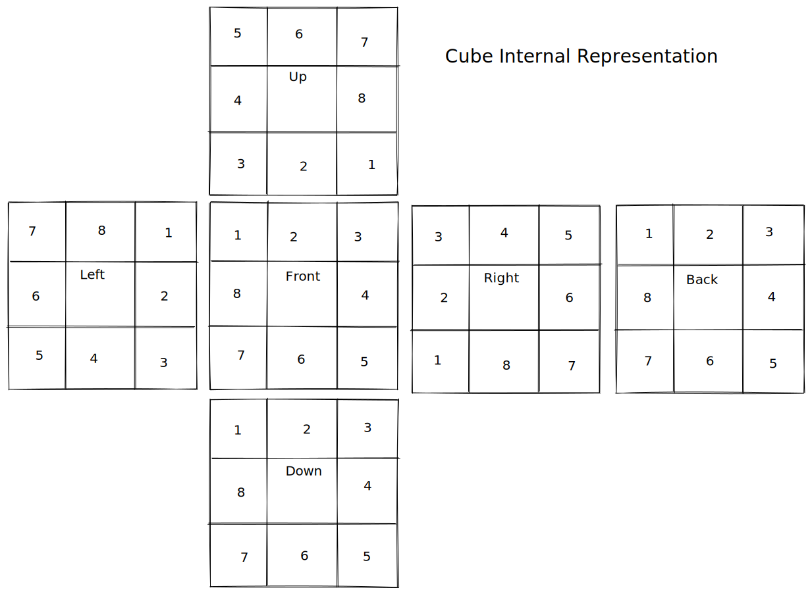
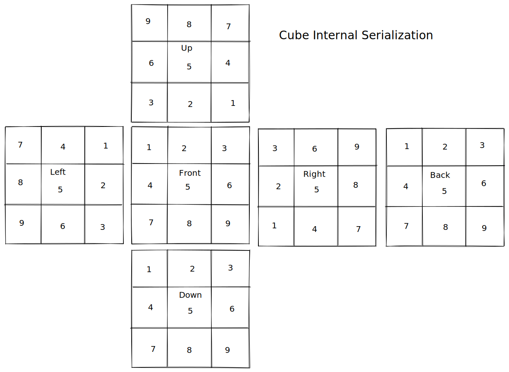
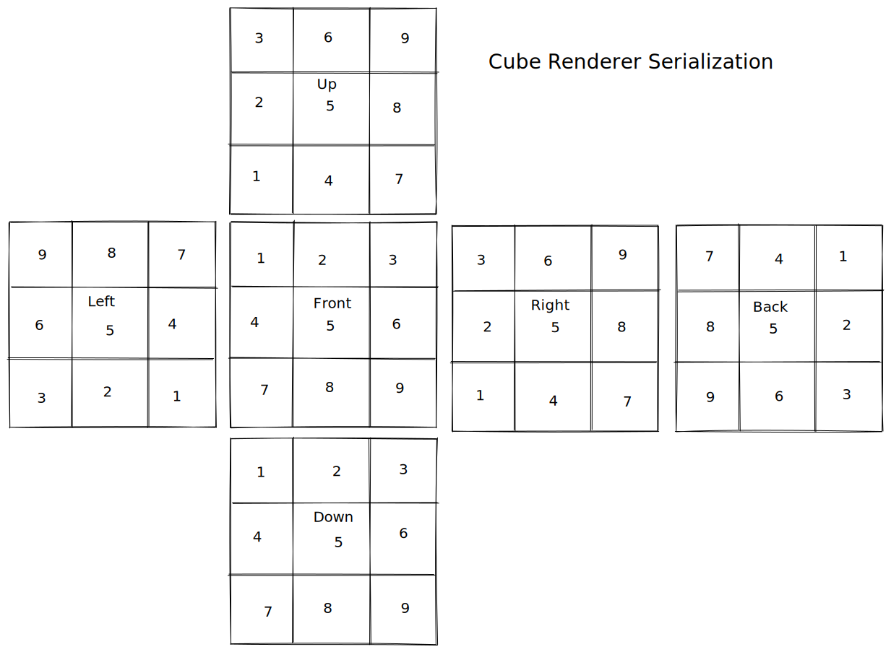

## Demo

[Click Here](http://butane.github.io/rubiks_cube)

## Requirements

- Node -> v14.17.2
- NPM -> v6.14.13

## Instructions

- Step 1: Clone the repository.
- Step 2: Run `npm install`.
- Step 3: Run `npm run build`.
- Step 4: Open the `index.html` file in `dist` folder in a browser.

NOTE: After Step 1, you can directly jump to Step 4 since the repository include latest `dist`.

## Cube Notation

- F - Front
- B - Back
- R - Right
- L - Left
- U - Up
- D - Down

## Cube Representations

